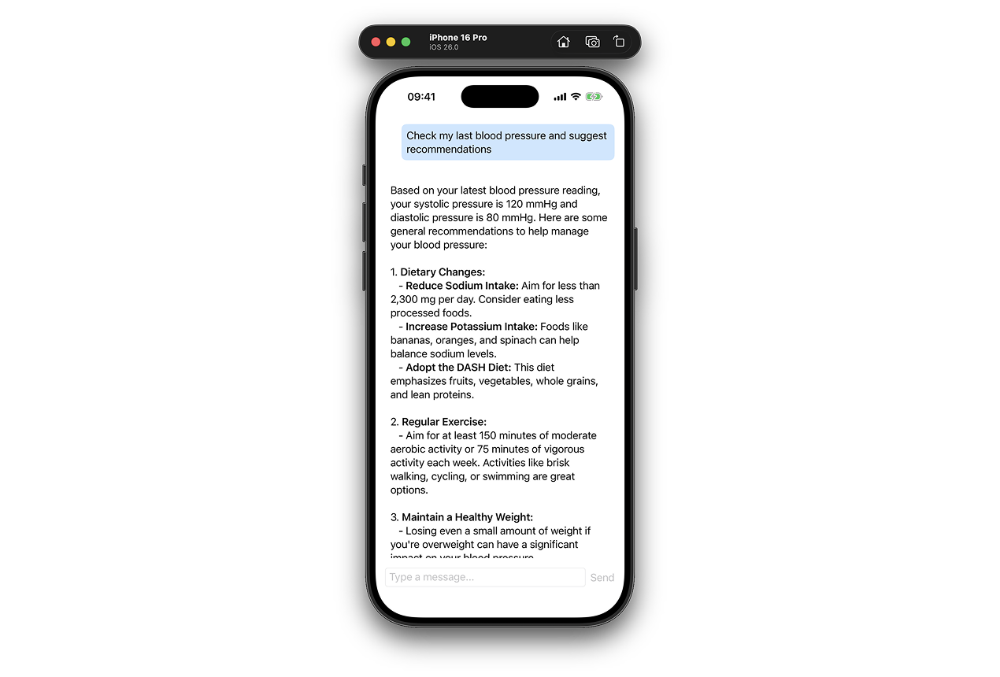

# FoundationModelsExample

An example project for [Getting Started with Apple's Foundation Models](https://www.artemnovichkov.com/blog/getting-started-with-apple-foundation-models) blog post.

  

## Author

Artem Novichkov, https://www.artemnovichkov.com/

## License

The project is available under the MIT license. See the [LICENSE](./LICENSE) file for more info.

